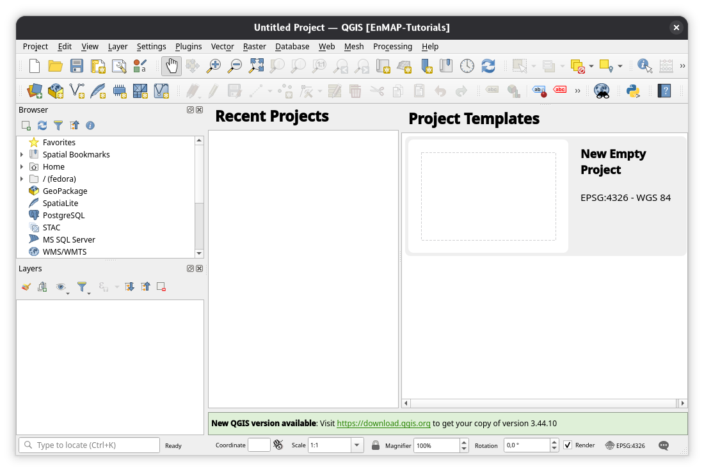
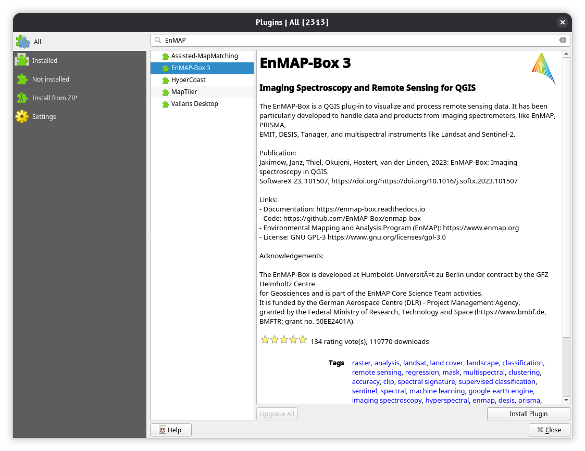

# EARSeL 2026 EnMAP Tutorials

EnMAP Tutorials at [14th EARSeL Workshop on Imaging Spectroscopy](https://is.earsel.org/workshop/14-IS-Helsinki2026/), 2-4 June 2026, Helsinki, Finland.


# Prerequisites

Participants are requested to bring their own Laptop.
Please install the required software in advance. 

The following setup is recommended:

1. Install a conda / conda-forge package installer, e.g., from https://conda-forge.org/download/
2. Create a conda environment that contains QGIS and *all python packages* that are required to run the tutorials.
   The environment is defined in the file [`enmaptutorials.yml`](../enmaptutorials.yml).

   ```bash
   # from web
   conda env create --file=https://raw.githubusercontent.com/EnMAP-Box/earsel2026_tutorials/enmaptutorials.yml -y 
   # from the directory where the file is located
   conda env create --file=enmaptutorials.yml -y
   ```
   
   
3. Activate the conda environment
   ````bash
   conda activate enmaptutorials
   ```` 
4. Start QGIS from the conda environment and use a new user profile dedicated to the tutorials
   ````bash
   (enmaptutorials) qgis --profile EnMAP-Tutorials
   ```` 
   

5. Open the QGIS Plugin Manager and install the EnMAP-Box plugin

   

   


# Schedule
## Part I (09:00 - 11:30)

* 09:00 - 09:30: [Installation of required software](tut_installation.md)
* 09:30 - 10:30: [EnMAP-Box](tut_enmapbox.md)
* 10:30 - 11:30: [EnMAP Data Access](tut_data_access.md)


## Part II (12:30 - tbd.)

* 12:30 – 13:30 [EnMAP Preprocessing Tool (EnPT)](tut_enpt.md)
* 13:30 – 14:30 [Water Tools](tut_water_tools.md) 
* 14:30 – 15:30 [EnSoMAP](tut_ensomap.md)

