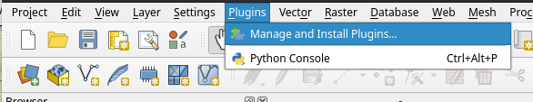

# Required Software

Some of The EnMAP tutorials are based on the [EnMAP-Box](https://enmap-box.readthedocs.io/) plugin for QGIS
and other Python packages.

The following setup is recommended to install the required software:

1. Install a conda / conda-forge package installer, e.g., from https://conda-forge.org/download/
2. Open a conda terminal and create a new conda environment that contains 
   QGIS and *all python packages* that are required to run the tutorials.
   
   The environment is defined in [`enmaptutorials.yml`](https://github.com/EnMAP-Box/earsel2026_tutorials/blob/main/enmaptutorials.yml). 
   To install call:

   ```bash
   conda env create --name enmaptutorials --file=https://raw.githubusercontent.com/EnMAP-Box/earsel2026_tutorials/refs/heads/main/enmaptutorials.yml
   ```
   
3. Activate the *enmaptutorials* conda environment
   ````bash
   conda activate enmaptutorials
   ```` 
4. Start QGIS from the conda environment and use a new user profile dedicated to the tutorials
   ````bash
   (enmaptutorials) qgis --profile EnMAP-Tutorials
   ```` 
   

5. Download the EnMAP-Box 3.17.7. [enmapboxplugin.3.17.7.zip](https://github.com/EnMAP-Box/enmap-box/releases/download/v3.17.7/enmapboxplugin.3.17.7.zip) from https://github.com/EnMAP-Box/enmap-box/releases/tag/v3.17.7 

6. Open the *QGIS Plugin Manager* -> *Install from ZIP* and install the EnMAP-Box from *enmapboxplugin.3.17.7.zip*
   
   


# References and Contact

## EnMAP-Box

* Mail: enmapbox@enmap.org
* Documentation: https://enmap-box.readthedocs.io
* Source Code: https://github.com/EnMAP-Box/enmapbox
* B. Jakimow, A. Janz, F. Thiel, A. Okujeni, P. Hostert, and S. van der Linden, “EnMAP-Box: Imaging spectroscopy in QGIS,” SoftwareX, vol. 23, p. 101507, 2023, doi: https://doi.org/10.1016/j.softx.2023.101507 

## EnMAP

* Webpage: https://enmap.org
* Chabrillat et al., “The EnMAP spaceborne imaging spectroscopy mission: Initial scientific results two years after launch,” Remote Sensing of Environment, vol. 315, p. 114379, Dec. 2024, doi: https://doi.org/10.1016/j.rse.2024.114379

